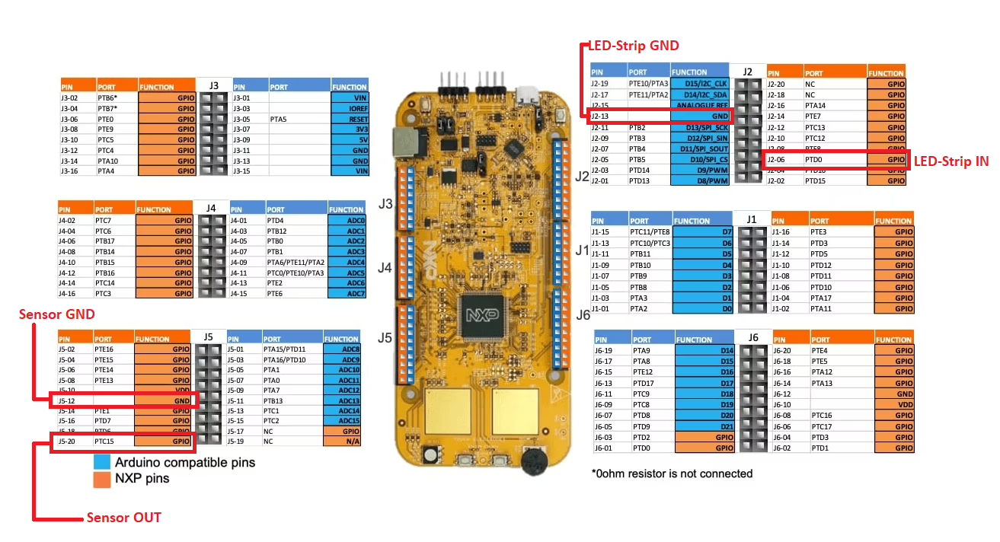

# Brakes Node Development

The application developed today will emulate a "brakes" node functionality: it will retrieve data from a pressure sensor, available on the prototyped board, and it will interpret the data to construct a signal that will configure the LEDs on the available LED strip. For the lowest pressure, no LED will be turned on. Whhile increasing the pressure applied to the sensor, more LEDs will be turned on sequencially. 

During this exercise, we will develop an application that can:
- acquire data from the pressure sensor.
- (minimally) process the acquired data to determine the number of LEDs that will be turned on. 
- construct an encoded signal and send it to the LED strip.

The guide and steps are provided through C comments inside the `main.c` file.

Resources:
- How does the LED strip work: 
  - https://www.pololu.com/file/0J1233/sk6812_datasheet.pdf
  - https://www.pololu.com/product/2526
- How to connect the wires:

