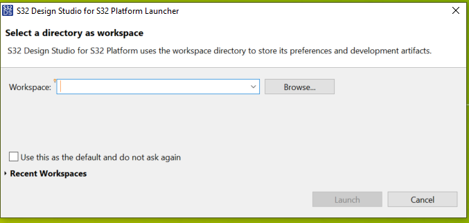
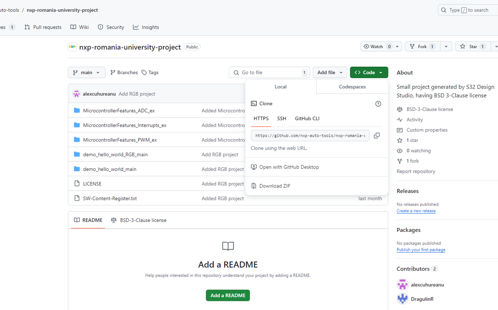
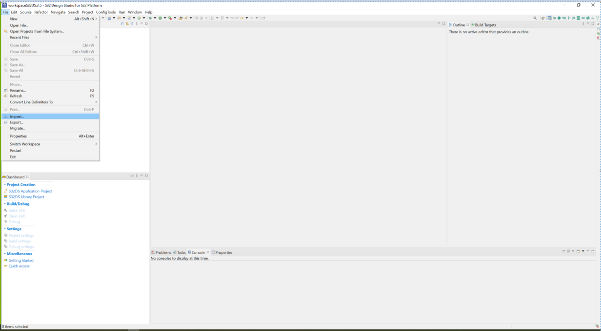
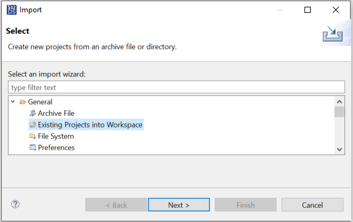
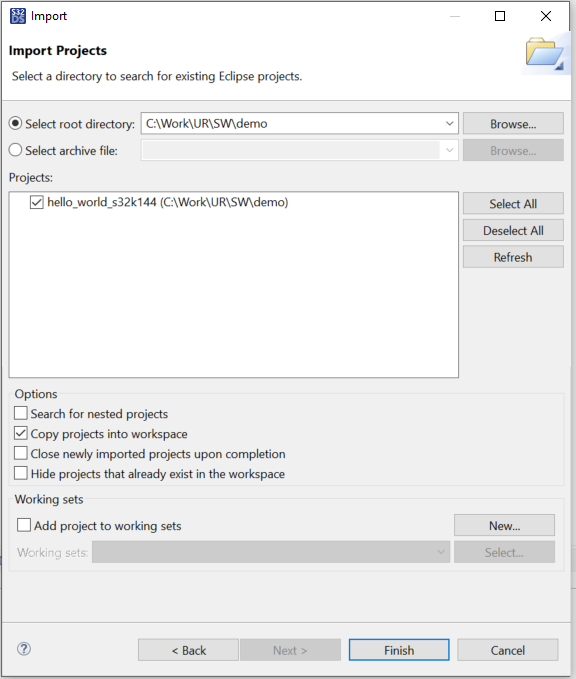
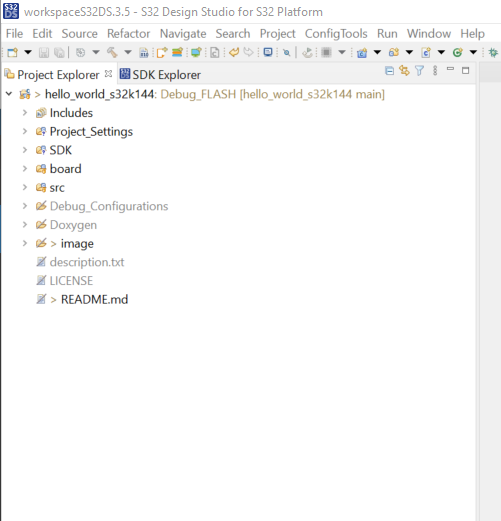
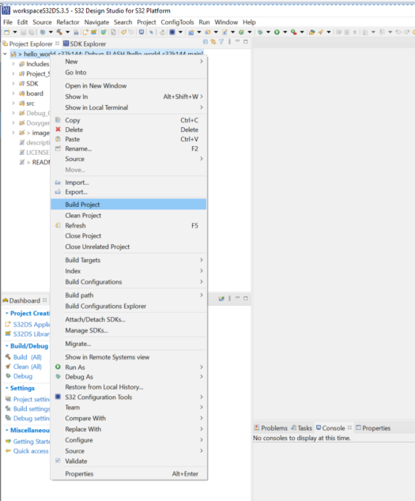
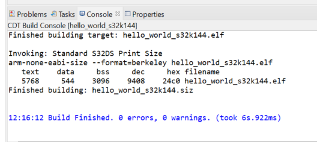

# Environment Setup

This repository contains material related to NXP's University program.  
This project implement de RED-YELLOW-BLUE blink actions.
It will turn on the three colors in an infinite loop.

Bellow is a step-by-step tutorial for environment setup.

## Environment description
As prerequisit, the VirtualBox image should be installed on your computer.
At startup, the S32 Design Studio icon should be visible on the desktop.

### 1. Click on S32 Design Studio icon.

### 2. Set the workspace folder used to store the projects and click Launch button.

### 3. Clone this repository on your local drive

### 4. Import the Demo project in S32 Design Studio

#### 1. File - Import

Select "Existing Projects into Workspace" Wizard

#### 2. Select the path to the local cloned repository

After importing the project, it should be visible in Projects window

### 5. Build the project

If the setup steps are done as described, the build command will be successful.

