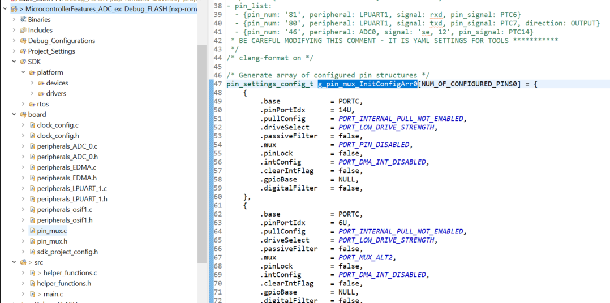

# Microcontroller Features - ADC Exercise
1. Download Hercules -> https://www.hw-group.com/software/hercules-setup-utility (alternative for Linux - Cool Term: https://learn.sparkfun.com/tutorials/terminal-basics/coolterm-windows-mac-linux)
2. Open application, connect to the S32K1 COM port.
3. Run the ADC application. 

Answer the following questions:
1. Which pins are configured inside `PINS_DRV_Init`? To navigate through function definitions, hold `Ctrl` + Click on the respective function call. Why? 

2. Research the following code line: `__asm("bkpt #255");`. What is its purpose?
3. Why do we need the `floatToStr` function?